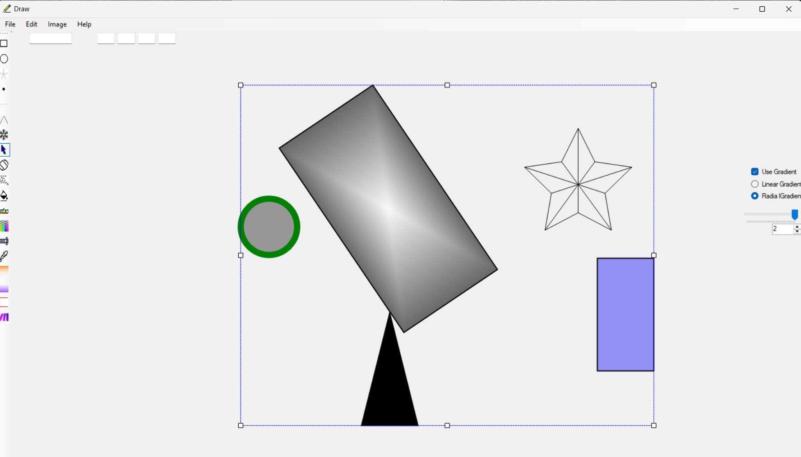

# 🖌️ Vector Shapes Editor

**Vector Shapes Editor** is a desktop application built with **C# and Windows Forms**.  
It allows users to create, edit, group, and manage vector-based shapes with rich support for **gradients**, **colors**, **opacity**, **saving**, **hotkeys**, and more.

This is a feature-rich and extensible drawing tool created as a personal project to explore vector graphics and UI/UX design.

---

## 🖼️ Screenshots

Take a look at the editor in action:

---

## 🧰 Features

### 🧱 Shape Tools
- Create vector shapes:  
  - **Rectangle**, **Ellipse**, **Triangle**, **Line**, **Polygon**, **Star**, and others.
- **Select**, **move**, **resize**, **rotate (90°)**, **group**, and **ungroup** shapes.

### 🎨 Styling
- Fill and stroke customization:
  - **Fill color**, **stroke color**, and **stroke thickness**
- Color selection:
  - By **RGB**, **Hex code**, or **name**
- **Gradient fill** support:
  - **Linear** and **Radial gradients** with multiple color stops
- **Opacity** control per shape
- **Color picker (eyedropper tool)** to select colors from canvas
- Display and reuse **last used color**

### 📂 File Support
- Save and load in formats:
  - **Binary**
  - **JSON**
  - **TIFF**
  - **PNG**
  - **JPG**

### 🧠 Advanced Editing
- Standard editing operations:
  - **Copy**, **Paste**, **Delete**, **Undo**, **Redo**
- **Context menu**, **Main menu**, and **Side toolbar**
- **Keyboard shortcuts** for quick access:
  - `Ctrl + C` – Copy
  - `Ctrl + V` – Paste
  - `Del` – Delete
  - `Ctrl + A` – Select All
  - `Ctrl + I` – Inversion

---

## 🖥 Technologies Used

- C# (.NET Framework)
- Windows Forms
- GDI+ for custom rendering
- OOP principles:
  - Composite pattern (grouping shapes)
- Binary and JSON serialization

---

## 🚀 How to Run

1. Clone the repository.
2. Run it.
3. Start drawing and editing shapes right away.

---

## 👩‍💻 About the Project

This project was created to dive deeper into desktop UI development, graphics programming, and good architectural practices in C#.  
It’s designed to be flexible, educational, and fun to use.

Feel free to clone, fork, or contribute!

---

**Made with ❤️ in C#**

